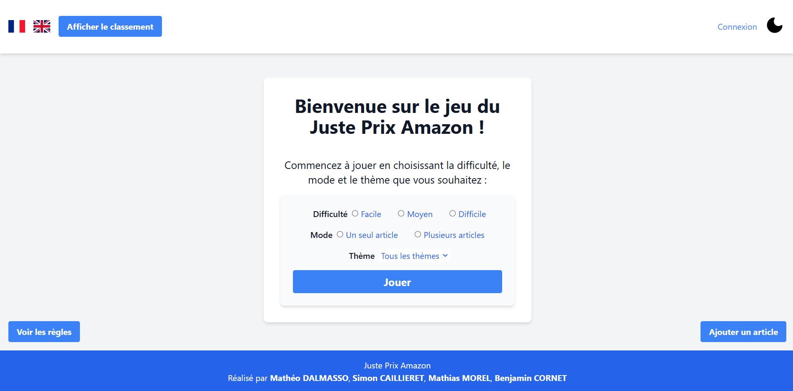

# MSI-LES-MASKS : Amazon Juste Prix 🎯

## 🚀 Lancer le projet 

1. Appuyer sur le bouton vert **Run** en haut à droite et il faut être sur **app.py**

2. Une fois que le serveur est lancé, cliquer sur le lien dans le terminal `http://127.0.0.1:5000`

---

## 🎮 **Fonctionnalités principales** :

- **Jouer au jeu :**
  - Appuyez sur le bouton **"Jouer"**.
  - Choisissez le **mode de difficulté** que vous souhaitez.
  - Sélectionnez le **thème de l'article** à deviner.
  - Sélectionnez un item ou plusieurs items à deviner.

- **Consulter le classement :**
  - Appuyez sur le bouton **"Classement"** pour voir les meilleurs scores.

- **Lire les règles :**
  - Appuyez sur le bouton **"Règles"** pour consulter les instructions du jeu (disponible uniquement sur la page d'accueil).

- **Se connecter :**
  - Appuyez sur le bouton **"Se connecter"** pour accéder à votre compte (le username c'est le nom de famille).

- **S'inscrire :**
  - Vous devez appuyer sur le bouton **"Connexion"** pour accéder à la page de connexion.
  - Ensuite cliquez sur **"Pas de compte ? Inscrivez-vous !"** pour accéder à la page d'inscription.

- **Ajouter un article :**
  - Appuyez sur le bouton **"Ajouter un article"**(disponible uniquement sur la page d'accueil).
  - Remplissez le **formulaire** qui apparaît.

- **Changer de mode (jour/nuit) :**
  - **Mode nuit :** Appuyez sur l'icône **lune** en haut à droite.
  - **Mode jour :** Appuyez sur l'icône **soleil** en haut à droite.

- **Changer de langue :**
  - **Français :** Appuyez sur le drapeau **"FR"** en haut à gauche.
  - **Anglais :** Appuyez sur le drapeau **"EN"** en haut à gauche.

- **Pour les sons :**
  - **Augmenter le son de votre ordinateur** pour entendre les bruitages (ils sont pas très forts).

- Page d'accueil

---

## 🧑‍🤝‍🧑 Répartition des rôles :
    - Mathias Morel : Scrum Master
    - Benjamin Cornet : Team member
    - Mathéo Dalmasso : Team member
    - Simon Caillieret : Team member
    
---

## 💡 Product Backlog

| Nom              | Description de la tâche                                                                 | Fait      |
|------------------|-----------------------------------------------------------------------------------------|-----------|
| Mathias Morel    | Fonction qui choisit aléatoirement un article Amazon                                    | ✔️        |
| Benjamin Cornet  | Fonction qui récupère l'image de l'article                                              | ✔️        |
| Benjamin Cornet  | Rectification des différentes fonctions de la base de données                           | ✔️        |
| Mathéo Dalmasso  | Fonction qui récupère le nom de l'article                                               | ✔️        |
| Simon Caillieret | Fonction qui récupère le prix de l'article                                              | ✔️        |
| Benjamin Cornet  | Ajout d'item : Un formulaire pour ajouter des items dans la BD                          | ✔️        |
| Benjamin Cornet  | Mode de difficultés : Choix de la difficulté                                            | ✔️        |
| Benjamin Cornet  | Un choix de pseudo stylé                                                                | ✔️        |
| Mathéo Dalmasso  | Tableau des scores consultable directement depuis le site                               | ✔️        |
| Mathias Morel    | Log in : Système de compte avec page de connexion et d'inscription                      | ✔️        |
| Mathias Morel    | Des thèmes pour chaque item                                                             | ✔️        |
| Mathias Morel    | Traduction : Rajouter un bouton en/fr pour traduire le site                             | ✔️        |
| Mathéo Dalmasso  | Bruitage : Ajouter des bruitages pour certaines actions                                 | ✔️        |
| Mathéo Dalmasso  | Page pour les règles                                                                    | ✔️        |
| Simon Caillieret | Mode nuit/jour : Pour ne pas agresser la rétine                                         | ✔️        |
| Simon Caillieret | Un timer : Comme dans le vrai jeu                                                       | ✔️        |
| Benjamin Cornet  | Style : Rajouter du style dans le site                                                  | ✔️        |
| Mathéo Dalmasso  | Une page d'accueil : Page racine avec un menu pour présenter le site et accéder aux autres pages | ✔️        |
| Simon Caillieret | Une page d'accueil : Page racine avec un menu pour présenter le site et accéder aux autres pages | ✔️        |
| Benjamin Cornet  | Une page d'accueil : Page racine avec un menu pour présenter le site et accéder aux autres pages | ✔️        |
| Mathias Morel    | Une page d'accueil : Page racine avec un menu pour présenter le site et accéder aux autres pages | ✔️        |

---

## 📋 Workflow :

Nous avons choisi d'utiliser une "feature branch workflow".
